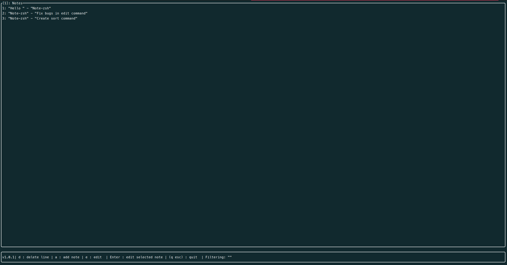

# Note - zsh

Simple note-taking command line tool in Zsh + TUI written in Rust.

> [!NOTE]
> CLI & TUI note-taking tool.

---

## Installation

### 1. Install via one-liner (recommended)

```sh
curl -fsSL https://github.com/K10-K10/Note-zsh/releases/latest/download/install.sh | zsh
```

- The latest version is: v1.1.1

This will:

* Download the latest `Note-zsh.tar.gz`
* Extract it to `~/.note-zsh`
* Copy the binary to `~/.local/bin/note`
* Add `note` to your `$PATH`
* Setup automatic update every 7 days in `.zshrc`

---

## CLI Usage (Zsh script)

Use it from anywhere:

```sh
note add <Title> <Note body>
note list
```

### Commands

| Command                                     | Description                                         | Option                                    |
| ------------------------------------------- | --------------------------------------------------- | ----------------------------------------- |
| `note list`                                 | List all saved notes                                | `<Title>` filter by title                 |
| `note add <Title> <Note body>`              | Add a new note. You can leave the note body empty.  |                                           |
| `note del <number>`                         | Delete note by number                               |                                           |
| `note del all`                              | Delete all notes (with confirmation)                |                                           |
| `note find <keyword>`                       | Search notes (case-insensitive, highlights matches) | `-t`, `-b` (Search only in title or body) |
| `note edit <number> <new title> <new body>` | Edit note                                           | `-t <new title>`, `-b <new body>`         |
| `note tui`                                  | Launch TUI interface                                |                                           |
| `note help`                                 | Show help message                                   |                                           |
| `note --version`                            | Show version info                                   |                                           |

---

## TUI

Run the interactive TUI interface:

```sh
note tui
```



Features:

* List and navigate notes
* Add, edit, delete notes interactively
* Filter/search notes
* Error messages and confirmation dialogs

---

## Demo

```sh
$ note add test test2
Note: Added "test" - "test2"

$ note add hoge
Note: Added "hoge" - ""

$ note list
Note:
0: test - test2
1: hoge -

$ note del 1
Note: Deleted note number 1

$ note find test
0: test - test2

$ note tui
# Launches the interactive UI
```

---

## Developer Guide (for TUI)

If you want to build and run the Rust TUI manually:

### Prerequisites

Install `rustup`, `cargo`, and required libraries:

```sh
curl --proto '=https' --tlsv1.2 -sSf https://sh.rustup.rs | sh
sudo apt install libssl-dev pkg-config
```

### Build & Run

```sh
cd note-rust
cargo run --release
```

---

## License

MIT
